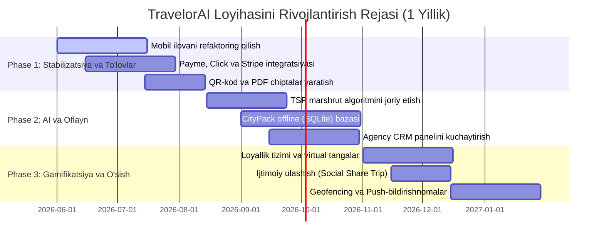

# TravelorAI - Rivojlantirish va Kengaytirish Strategiyasi

Ushbu hujjat **TravelorAI** startap loyihasining hozirgi texnik holatini tahlil qiladi va uni ham biznes, ham texnik tomondan rivojlantirish bo'yicha batafsil yo'l xaritasi (roadmap) hamda tavsiyalarini taqdim etadi.

---

## 1. Hozirgi Texnologik Holat va Tizim Arxitekturasi (Audit)

TravelorAI platformasi uchta asosiy qismdan tashkil topgan:
1. **Express Backend**: Ma'lumotlar bazasi (PostgreSQL & Prisma ORM), Redis (keshlash), Gemini API (trip planner) va Yandex Maps API integratsiyasini boshqaradi.
2. **Next.js Web App**: Administratorlar va sayyohlik agentliklari (Agency Portal) uchun veb-interfeys.
3. **Expo React Native Mobile App**: Sayyohlar uchun asosiy mobil dastur.

### 🔍 Kod va Servislar Tahlili

*   **AI Planner tizimi (`backend/src/services/geminiPlanner.service.js` va `planner.service.js`)**: 
    Hozirgi tizim Yandex Places API va mahalliy bazadan POI (Points of Interest) ma'lumotlarini yig'adi, so'ngra ularni Gemini modeliga uzatib, foydalanuvchi talablariga mos (byudjet, kunlar, uslub) sayohat rejasini o'zbek lotin alifbosida shakllantiradi va qayta ishlaydi. Tizimda yaxshi fallback mexanizmi o'rnatilgan (Gemini bo'lmasa ham baza orqali tayyor reja qaytadi).
*   **Gamifikatsiya (`backend/src/services/achievements.service.js`)**: 
    Foydalanuvchilarning faolligini oshirish uchun asosiy yutuqlar (masalan: `first_trip`, `three_city_explorer`, `budget_traveler`) belgilangan. Biroq, bu tizim hozircha faqat statistika ko'rinishida bo'lib, biznes qiymatga ega emas.
*   **Mobil Ilova Arxitekturasi (`mobile/app/(tabs)/explore.tsx` va `planner.tsx`)**:
    Sahifalar juda katta hajmli (masalan, `explore.tsx` 147 KB, `planner.tsx` 71 KB). UI elementlari, API chaqiriqlari va inline hisob-kitoblar bitta fayl ichida aralashib ketgan. Bu kelajakda kodni o'zgartirish va yangi dasturchilar qo'shilishini qiyinlashtiradi.
*   **DevOps va Deployment (`ops/` va `docker-compose.yml`)**:
    Docker compose orqali barcha servislarni oson ishga tushirish (PostgreSQL, Redis, Express, Next.js, Nginx) poydevori tayyorlangan. VPS (virtual server) sozlamalari ham mavjud.

---

## 2. Platformani Rivojlantirish Bo'yicha Texnik va Biznes Takliflar

TravelorAI platformasini bozorga olib chiqish va uni raqobatchilardan ustun qilish uchun quyidagi 5 ta yo'nalishda ish olib borish tavsiya etiladi.

### Yo'nalish 1: AI Planner va Marshrutlarni Optimallashtirish

Hozirgi trip planner asosan joylarni tavsiya qiladi va kunlarga taqsimlaydi. Uni haqiqiy "aqlli yordamchi"ga aylantirish uchun quyidagilar kerak:

*   **Marshrutlarni optimal tartiblash (TSP - Travelling Salesperson Problem)**:
    Kunlik rejadagi diqqatga sazovor joylar (POI) geografik jihatdan uzoq-yaqinligiga qarab tartiblanishi kerak. Hozirda foydalanuvchilar xaritada bir joydan ikkinchi chekkadagi joyga betartib borib kelishlari mumkin. Masofani hisoblash uchun Yandex Router API yoki bepul OSRM (Open Source Routing Machine) integratsiya qilinishi va joylar optimal zanjir ko'rinishida (`A -> B -> C`) tartiblanishi zarur.
*   **Structured Outputs va Gemini Prompt Optimizatsiyasi**:
    `geminiPlanner.service.js`da `responseJsonSchema` ishlatilgan. Uni yanada rivojlantirib, Gemini 2.5/3.5 Flash modellaridan foydalangan holda javob qaytish tezligini oshirish lozim. Promptda joylarning ish vaqtlari (opening hours) va kirish narxlari dynamic tarzda Gemini contextiga uzatilishi kerak, shunda AI yopiq muzeyga yoki byudjetdan tashqari qimmat joyga reja qilmaydi.
*   **Dynamic Weather & Seasonality Integration**:
    Sayohat rejalashtirilayotgan sanadagi ob-havo prognozi bazasida reja moslashtirilishi lozim. Masalan, yomg'irli kunda yopiq muzeylar va galereyalar, quyoshli kunda esa ochiq tabiat va bog'lar tavsiya etiladi.

---

### Yo'nalish 2: Marketplace va Monetizatsiyani Kuchaytirish

Marketplace qismini passiv ro'yxatdan faol savdo platformasiga aylantirish talab etiladi:

*   **Avtomatlashtirilgan To'lov Tizimlari (Payment Gateways)**:
    Mahalliy foydalanuvchilar uchun **Click**, **Payme**, **Uzum Pay** integratsiyasi, chet ellik turistlar uchun esa **Stripe** integratsiyasini yo'lga qo'yish kerak. Tizimda to'lov amalga oshirilgach, `TourBooking` statusi `confirmed` holatiga o'tadi va avtomatik tarzda PDF-chipta hamda QR-kod generatsiya qilinadi.
*   **Agentliklar uchun Premium CRM va Analytics Panel (`website/app/agency`)**:
    Turistik agentliklarga o'z turlarini boshqarish, buyurtmalar statistikasini ko'rish (conversion rate, daromad, faol turistlar) hamda turistlar bilan to'g'ridan-to'g'ri bog'lanish (chat tizimi) imkonini beruvchi mukammal CRM interfeysi Next.js portalida yaratilishi kerak.
*   **Dynamic Pricing va Promokodlar**:
    Mavsumiy va tezkor chegirmalar, agentliklar uchun o'z turlariga promokodlar yaratish imkoniyati hamda guruh bo'lib ro'yxatdan o'tganlarga (masalan, 3 kishidan ko'p bo'lsa 10% chegirma) avtomatik narx hisoblash tizimini joriy etish.

---

### Yo'nalish 3: Mobil Ilova Arxitekturasini Yaxshilash va Offline Rejim

Mobil dasturning ishlash tezligi va oflayn qobiliyati sayyohlar uchun hayotiy ahamiyatga ega:

*   **Kodni Component va Custom Hooks'ga Refaktoring qilish**:
    `explore.tsx` va `planner.tsx` sahifalarini mayda bo'laklarga ajratish kerak. Masalan:
    *   `components/planner/PlannerForm.tsx` (sanalar va shahar tanlash)
    *   `components/planner/BudgetSelector.tsx` (byudjet sozlamalari)
    *   `hooks/usePlanner.ts` (API chaqiriqlari va reja holatini boshqaruvchi logika)
*   **Zustand orqali Global State Management**:
    AsyncStorage va inline state'lar o'rniga engil va tezkor **Zustand** kutubxonasini o'rnatish lozim. Bu orqali trip rejalari, foydalanuvchi ma'lumotlari va keshlar butun ilova bo'ylab oson boshqariladi.
*   **Offline Mode va City Packs (`CityPack` model integratsiyasi)**:
    O'zbekistonning tog'li va chekka hududlarida (masalan, Zomin, Buxoro/Xiva cho'l yo'llari) internet aloqasi juda yomon. Sayyoh xaritani va o'z rejasini oflayn ko'ra olishi uchun mobil ilovaga **SQLite** (yoki Expo SQLite) integratsiya qilinib, `CityPack` yuklanganda barcha POIlar, transport marshrutlari va oflayn xarita keshlanadi.

---

### Yo'nalish 4: Rag'batlantirish (Gamification) va Growth Hacking

Foydalanuvchilarni ilovada ushlab turish (retention) va organik o'sishni ta'minlash:

*   **Yutuqlarni Marketplace Chegirmalari bilan Bog'lash (Loyalty Integration)**:
    Hozirgi `achievements.service.js` dagi yutuqlarni amaliy qiymatga ega qilish. Masalan:
    *   `three_city_explorer` yutug'ini ochgan turistga hamkor agentliklardan 5% chegirma promokodi beriladi.
    *   Har bir tugatilgan sayohat uchun foydalanuvchiga "Travelor Coins" (ichki valyuta) beriladi va ular keyingi turlarni bron qilishda ishlatiladi.
*   **Social Sharing (Sayohat kartasi va rasm generatori)**:
    Sayyohlar o'z sayohat rejalarini (chiroyli chizilgan xarita, boradigan shaharlar va yutuqlar bilan) Instagram Stories yoki Telegramda ulashishlari uchun visual render formatini yaratish. Mobil ilovada chiroyli infografika rasm shaklida yuklab olinadi va unda TravelorAI brendingi/QR-kodi bo'ladi. Bu organik reklama oqimini ta'minlaydi.
*   **Real-time Push Notification (Geofencing eslatmalar)**:
    Turist Samarqandda Regisondan o'tayotganda, mobil ilova fon rejimida uning joylashuvini aniqlab (Expo Location background) push-xabar yuboradi: *"Siz Registon yaqinidasiz! Ushbu joy haqida ma'lumotni o'qing va yaqin atrofdagi eng yaxshi somsa kafesini ko'ring"*.

---

### Yo'nalish 5: DevOps, Xavfsizlik va Monitoring

Tizim barqarorligi va foydalanuvchilar xavfsizligini kafolatlash:

*   **Sentry Error Monitoring**:
    Mobil ilova va backendda yuz bergan barcha crash va xatoliklarni real vaqtda kuzatish uchun **Sentry** xizmatini ulash.
*   **GitHub Actions va EAS CI/CD Pipelines**:
    Har bir commitda testlarni avtomatik ishga tushiradigan (`npm run test`), Docker buildlarni tekshiradigan va VPS'ga deploy qiladigan GitHub Actions quvurini yaratish. Mobil ilovani esa Expo Application Services (EAS) orqali avtomatik tarzda Google Play va App Store test guruhlariga yuklash.
*   **API Rate Limiting va Xavfsizlik**:
    Backendda `express-rate-limit` va `helmet` mavjud. Ammo API marshrutlarida (ayniqsa Gemini Planner va Yandex Search kabi qimmat turadigan chaqiriqlarda) foydalanuvchi IDsi bo'yicha qat'iy cheklovlar qo'yilishi va ddos hujumlaridan himoya kuchaytirilishi lozim.

---

## 3. Rivojlantirish Yo'l Xaritasi (Roadmap: 1 Yillik Reja)

Loyihani bosqichma-bosqich ishlab chiqish rejasi:

### 📅 Batafsil Bosqichlar Jadvali

| Bosqich | Vazifalar | Texnik Stack / Kerakli Asboblar | Kutilayotgan Natija |
| :--- | :--- | :--- | :--- |
| **1-Bosqich: Foundation & Billing** (1-3 oy) | - Katta sahifalar (`explore.tsx`, `planner.tsx`) refaktoringi va componentlarga ajratish. - Zustand state management kiritish. - Payme, Click va Stripe to'lov tizimlarini backend va frontendda ulash. - Booking flow tugatilib, QR/PDF vaucher yuborish tizimini yo'lga qo'yish. | React Native, Zustand, Express, Payme/Click APIs, PDFKit / Puppeteer | Mobil ilova kodi toza, barqaror va haqiqiy pullik tranzaksiyalar ishlamoqda. |
| **2-Bosqich: AI & Optimization** (4-6 oy) | - Joylar orasidagi masofa bo'yicha kunlik rejani tartiblovchi TSP algoritmini qo'shish. - Oflayn ishlash uchun mobil ilovaga SQLite integratsiyasi va `CityPack`larni yuklash mexanizmi. - Next.js platformasidagi `/agency` CRM panelini yakunlab, agentliklarni ommaviy jalb qilish. | SQLite, Yandex Directions API, Next.js Tailwind, Node.js worker threads | Sayohat rejalari geografik jihatdan optimal, tog'larda internet yo'q bo'lsa ham ishlaydi, agentliklar uchun CRM tayyor. |
| **3-Bosqich: Gamification & Growth** (7-12 oy) | - Achievements (yutuqlar) xizmatini turlar va hamkor joylardagi chegirmalar bilan bog'lash. - Ilovada sayohat rejasini Instagram stories uchun rasm ko'rinishida generatsiya qilish. - Background Location orqali yaqin atrofdagi POIlar bo'yicha push-xabarlar yuborish. | Canvas API (yoki native screenshot component), Expo Location background, OneSignal / Firebase Cloud Messaging | Foydalanuvchilar o'z sayohatlarini ulashadi (organik reklama), gamifikatsiya orqali uzoq muddat dasturda qolishadi (retention). |

---

## 4. Muhim Tavsiyalar va Xulosa

1.  **Kod Sifati birinchi o'rinda**: Hozirda mobil ilovadagi `explore.tsx` kabi 150 KB atrofidagi fayllar kelajakda dasturni yangilash tezligini keskin pasaytiradi. Ishni refaktoringdan boshlash shart.
2.  **API Harajatlarini Nazorat Qilish**: Yandex Search va Gemini API so'rovlari pullik. Har bir foydalanuvchining so'rovlarini Redis keshida (hoziroq 10 daqiqalik kesh o'rnatilgan, buni ba'zi statik joylar uchun 1 kungacha oshirish mumkin) saqlash va API so'rovlarini limitlash xarajatlarni ancha tejaydi.
3.  **Mahalliy Bozorga Moslashuv**: O'zbekiston ichki turizmi jadal o'smoqda. Mahalliy to'lov tizimlari va o'zbek tilidagi reja tuzuvchi AI sizning eng katta raqobatbardosh ustunligingiz hisoblanadi.

Ushbu yo'l xaritasi bo'yicha savollar bo'lsa yoki biror bosqichni (masalan, to'lov integratsiyasi yoki mobil ilovani refaktoring qilish) amalda boshlamoqchi bo'lsangiz, buyruq bering – birgalikda kod yozishni boshlaymiz!
